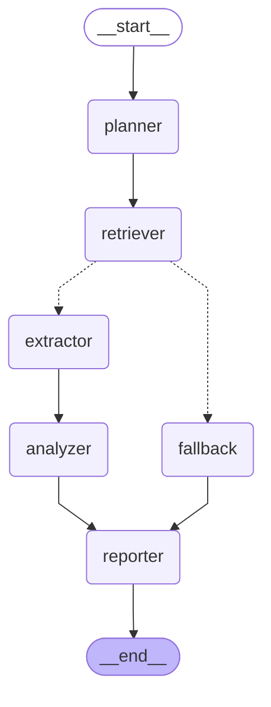

# Agentic Search Intelligence System

A production-minded multi-agent pipeline built with LangGraph and FastAPI that analyzes brand visibility in search results and AI-generated answers.

## Overview

This system takes a brand profile and runs a DAG-based pipeline to analyze how the brand appears in:
- Google Search (SERP)
- Google AI Overview
- LLM answers (ChatGPT, Gemini)

It then generates actionable content recommendations to improve visibility.

## DAG Diagram



## Agent Responsibilities

| Agent | Responsibility |
|---|---|
| Query Planner | Takes brand profile, uses LLM to generate relevant search queries |
| Retrieval Agent | Calls DataForSEO tools (SERP, AI Overview, LLM Visibility) for each query |
| Extractor | Normalizes raw API responses into clean structured format |
| Analyzer | Calculates opportunity scores and generates content recommendations via LLM |
| Reporter | Assembles final structured report (JSON + human-readable summary) |
| Fallback | Handles retrieval failures — returns partial results instead of crashing |

## Setup

### Requirements
- Python 3.12+
- PostgreSQL
- OpenAI API key
- UV package manager

### Installation

```bash
# Clone the repo
git clone https://github.com/UmarEhtisham/DAG.git
cd DAG

# Create virtual environment
uv venv
source .venv/bin/activate

# Install dependencies
uv sync

# Copy env file
cp .env.example .env
# Add your OpenAI API key in .env
```

### Database Setup

```bash
# Start PostgreSQL (if using Docker)
docker compose up -d

# Or if PostgreSQL is already installed
sudo service postgresql start
sudo -u postgres psql -c "CREATE DATABASE search_intel;"
sudo -u postgres psql -c "ALTER USER postgres PASSWORD 'postgres';"
```

### Run

```bash
uvicorn app.main:app --reload
```

API docs available at: `http://localhost:8000/docs`

## API Endpoints

| Method | Endpoint | Description |
|---|---|---|
| POST | `/api/v1/profiles` | Register a new brand profile |
| GET | `/api/v1/profiles/{id}` | Get profile with stats |
| POST | `/api/v1/profiles/{id}/run` | Trigger the full DAG pipeline |
| GET | `/api/v1/profiles/{id}/queries` | Get all queries from last run |
| GET | `/api/v1/profiles/{id}/recommendations` | Get content recommendations |
| POST | `/api/v1/queries/{id}/recheck` | Re-run pipeline for a single query |

## DataForSEO Mode

```bash
# Mock mode (default) — no API key needed
DATAFORSEO_MODE=mock

# Live mode — requires real DataForSEO credentials
DATAFORSEO_MODE=live
DATAFORSEO_LOGIN=your_login
DATAFORSEO_PASSWORD=your_password
```

This assessment uses mock mode by default. Mock responses simulate realistic DataForSEO API responses. Live mode is implemented but not tested with real credentials due to sandbox access limitations.

## Failure Handling

- Retry logic with exponential backoff for transient errors (2s, 4s, 8s)
- Permanent errors (auth failure, bad request) fail immediately without retry
- After all retries exhausted — DAG routes to fallback node
- Fallback returns partial results with error details instead of crashing

### Simulated Failure Example

```python
# test_failure_retry.py
mock_serp.side_effect = Exception("Simulated SERP failure")
# Pipeline routes to fallback → returns status: "partial"
```

## Observability

Structured JSON logging for every node execution:

```json
{"timestamp": "2026-09-05T11:01:34Z", "level": "INFO", "node": "analyzer", 
 "message": "Analyzer completed. 5 insights generated", 
 "run_id": "abc-123", "duration_ms": 8404.22, "status": "success"}
```

Each log includes:
- `run_id` — trace a single pipeline run node by node
- `duration_ms` — per-node latency
- `status` — started / success / failed

### Production Observability Improvements

Given more time, would add:
- OpenTelemetry integration for distributed tracing
- Prometheus metrics (per-node latency, success/failure rates)
- Centralized log aggregation (Datadog, CloudWatch)
- Alerting on high failure rates

## Tests

```bash
uv run pytest tests/ -v
```

- `test_happy_path.py` — full pipeline run with mock data
- `test_failure_retry.py` — simulated API failure with fallback
- `test_tool_validation.py` — tool argument validation

## Known Limitations

- Tools are called programmatically rather than via LLM tool-calling (`@tool` decorator). In production, LLM would decide when and how to call tools.
- `estimated_search_volume` and `competitive_difficulty` return 0 in mock mode.
- No async/background processing — pipeline runs synchronously (10-30s per run).
- Live DataForSEO endpoints implemented but not tested with real credentials.

## What I Would Improve With More Time

- Implement proper LLM tool-calling with `@tool` decorator and Pydantic schemas
- Add async pipeline execution with Celery
- Add circuit breaker pattern for repeatedly failing dependencies
- Add LangSmith tracing for full DAG observability
- Test live DataForSEO integration with real credentials
- Add rate limiting on API endpoints